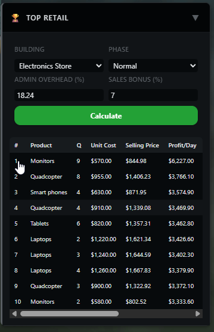
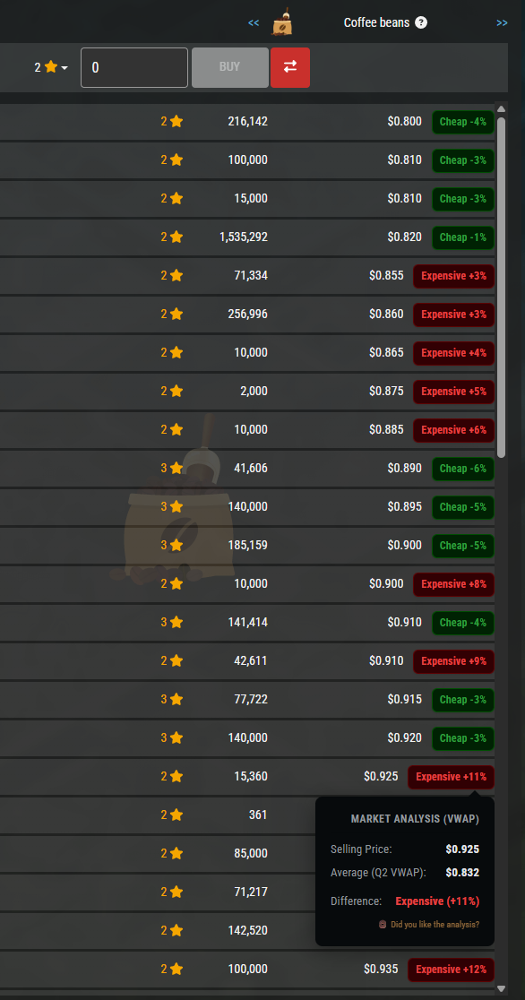
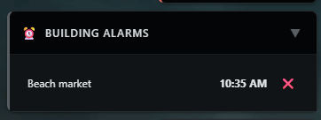
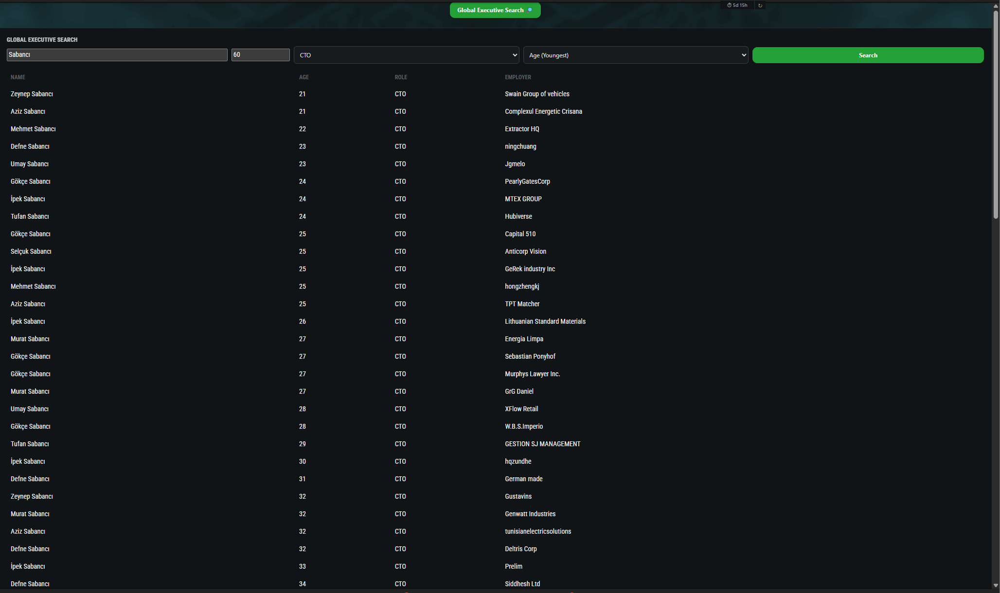
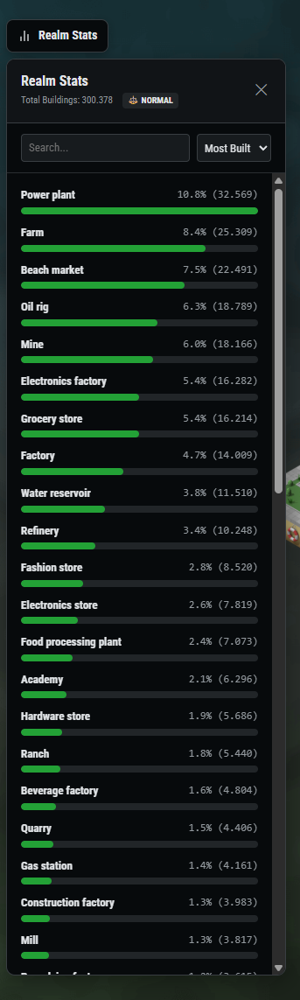
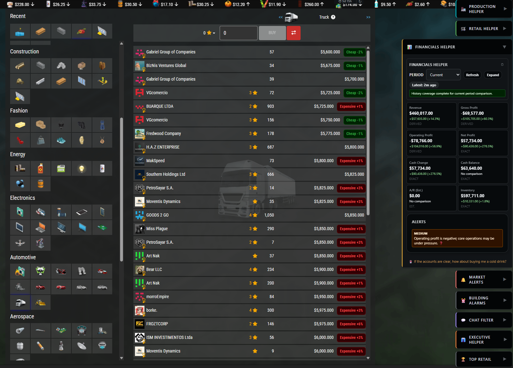
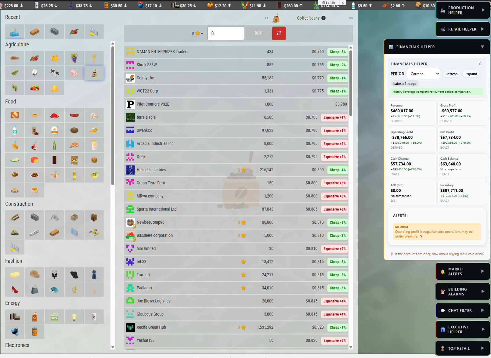

# SimCo Manager — The Best Browser Extension for Sim Companies

> **SimCo Manager** is the most feature-rich, all-in-one companion extension for [Sim Companies](https://www.simcompanies.com/) — the popular online business simulation game. It injects **20+ powerful tools** directly into the game interface: real-time profit calculators, a full financial dashboard, VWAP market analysis, smart contract ranking, building alarms, chat intelligence, executive headhunter search, and much more — all in **12 languages**, for **free**.

[🇬🇧 English](#-features-at-a-glance) · [🇹🇷 Türkçe](#türkçe)

---

<!-- 🔍 SEO Keywords: Sim Companies extension, Sim Companies browser extension, Sim Companies helper, Sim Companies calculator, Sim Companies chrome extension, Sim Companies firefox extension, Sim Companies profit calculator, Sim Companies retail calculator, Sim Companies production calculator, Sim Companies market alerts, Sim Companies VWAP, Sim Companies contract manager, Sim Companies cashflow tracker, Sim Companies financial dashboard, Sim Companies chat filter, Sim Companies executive search, Sim Companies headhunter, Sim Companies building alarm, Sim Companies profit per hour, Sim Companies PPHPL calculator, Sim Companies top retail, Sim Companies realm stats, best Sim Companies tool, best Sim Companies extension, SimCo Manager, Sim Companies automation, Sim Companies companion, Sim Companies helper extension, Sim Companies market analysis, Sim Companies dark mode, Sim Companies sidebar, Sim Companies XP calculator, Sim Companies level up calculator -->

## ⚡ Why SimCo Manager?

Most Sim Companies players rely on **spreadsheets, calculators, and manual math** to run their business. SimCo Manager eliminates that overhead entirely — it injects **real-time analysis tools directly into the game UI**, giving you an unfair advantage:

| What you get | Without SimCo Manager | With SimCo Manager |
|---|---|---|
| **Profit Analysis** | Manual spreadsheet calculations | 📊 Instant P&L dashboard with 8 KPI cards |
| **Market Pricing** | Check prices one by one | 📈 VWAP badges on every listing — see "Cheap" / "Expensive" at a glance |
| **Contract Decisions** | Guess which contract is best | 🏅 Gold / Silver / Bronze auto-ranking with ROI % |
| **Retail Optimization** | Trial and error | 🏆 Top 10 most profitable items calculated instantly |
| **Production Planning** | Estimate costs manually | 🏭 Break-even prices + upgrade projections in one click |
| **Market Monitoring** | Refresh the page constantly | 🔔 Price alerts + chat keyword alerts running in the background |
| **Executive Hiring** | Browse one by one | 🔍 Global headhunter search across the entire realm |
| **Building Timers** | Set your own phone alarm | ⏰ Browser notification when production finishes |
| **Chat Deals** | Scroll through hundreds of messages | 💬 Filter buying/selling messages by product name |
| **Selling Items** | Type chat messages manually | 📦 One-click sales/purchase message builder |

> **20+ features** · **12 languages** · **Chrome & Firefox** · **100% free** · **No data collection**

---

## 🧩 Features at a Glance

### 📋 Sidebar Menu

The extension adds a sleek, collapsible sidebar to Sim Companies with quick access to all tools. Toggle visibility with **Alt+H** keyboard shortcut. Your sidebar state persists across sessions.

  

---

### 🏭 Production Helper

Analyze production costs, profit margins, and break-even prices **before you start producing**. Includes **building upgrade projections** so you can see exactly how your next upgrade affects profitability.

- ✅ Cost per unit and total production cost breakdown
- ✅ Profit analysis for **Market Sell** (full transport + 4% fee) and **Contract Sell** (50% transport, no fee)
- ✅ Break-even price thresholds for both scenarios
- ✅ Profit margin percentages
- ✅ **Building upgrade projection** — current vs. projected comparison with quantity and cost deltas

  
  &nbsp;&nbsp;
  

---

### 🛒 Retail Helper

Real-time retail profitability calculator. Shows **profit per minute**, per hour, and per day — plus live **Market Pulse** data with saturation and average retail price trends.

- ✅ Profit per minute / hour / day calculations
- ✅ Retail vs. Market sell comparison — instantly see which method wins
- ✅ **Market Pulse indicator** — Hot, Recovery, Crowded, Falling, Stable
- ✅ Saturation percentage with trend direction
- ✅ Average retail price with change percentage
- ✅ CMO in-training warning (retail margin may be reduced)

  

---

### 🏆 Top Retail Calculator 🆕

Find the **most profitable retail products** for any store type. Calculates the top 10 items ranked by **PPHPL** (Profit Per Hour Per Level) — the gold standard metric for retail optimization.

- ✅ **10 store types** — Grocery, Gas Station, Fashion, Car Dealership, Electronics, Hardware, Toy Shop, Sweet Shop, Halloween Shop, Gift Shop
- ✅ Quality sweep (Q0–Q9) for maximum accuracy
- ✅ Configurable **Admin Overhead %**, **Sales Bonus %**, and **Economy Phase**
- ✅ Metrics: Profit/Day, Revenue/Day, Units/Hr, Units/Day, Cost, Price, PPHPL
- ✅ Click any result row to auto-load it in Retail Helper

  

---

### 💰 Financials Helper — Full P&L Dashboard

The most comprehensive **financial dashboard** available for Sim Companies. A complete P&L statement, cash flow tracking, balance sheet snapshot, financial health ratios, and intelligent alerts — all in one panel.

- ✅ **8 KPI cards**: Revenue, Gross Profit, Operating Profit, Net Profit, Cash Change, Cash Balance, A/R Estimate, Inventory
- ✅ **Period selection**: Current, Day, Week, Month — with period-over-period comparison (delta + %)
- ✅ **Compact vs. Expanded view** toggle
- ✅ **Expanded view** includes:
  - P&L Summary with Direct Costs, Operating Overhead, Non-Operating
  - Sales Channels breakdown (Retail, Contracts, Market, Other)
  - Cost Buckets breakdown (Production, Wages, Market Buy, Fees, Construction)
  - Cash Movement (Inflows, Outflows, Opening/Closing)
  - Balance Sheet Snapshot (Assets, Equity, Liabilities, Rank)
  - Financial Health Ratios (Gross/Operating/Net Margin, Current Ratio, Debt/Assets)
  - Top Drivers analysis (biggest income/expense changes)
  - Recent Transaction history with filter
- ✅ **Smart Alerts** (cash drain, liquidity warnings, operating loss, high inventory)
- ✅ Copy dashboard to clipboard
- ✅ Auto-refreshes every 5 minutes

  

---

### 📈 VWAP Market Analysis 🆕

See instantly whether a market listing is **overpriced or underpriced** compared to the Volume-Weighted Average Price (VWAP). Color-coded badges appear directly on exchange listings.

- ✅ **"Expensive +X%"** (red) and **"Cheap -X%"** (green) badges on every listing
- ✅ Click any badge to see a detailed popover: Selling Price, Quality-specific VWAP Average, and Difference %
- ✅ Data sourced from SimcoTools API for accuracy
- ✅ Works on all exchange/market pages
- ✅ Updates automatically when you browse different products

  

---

### 🔔 Market Alerts

Set price alerts for any product and quality level. The extension monitors market prices **in the background** and notifies you when prices drop below your target.

- ✅ Monitor up to **2 products** simultaneously
- ✅ Select specific quality levels (Q0–Q5)
- ✅ Live current price tracking with last-checked timestamps
- ✅ States: Monitoring, Triggered, Stopped
- ✅ Checks every 2 minutes automatically
- ✅ Persisted across sessions

  

---

### ⏰ Building Alarms 🆕

Never miss a production cycle again. Set alarms for any building and receive a **browser notification** the moment production finishes — no need to keep checking the game.

- ✅ **🔔 button** injected directly on the map next to building timers
- ✅ Chrome notification when production completes
- ✅ View and manage all active alarms in the sidebar
- ✅ Cancel alarms individually with one click
- ✅ Auto-cleanup of expired alarms

  
  &nbsp;&nbsp;
  

---

### 💬 Chat Filter — Search & Alerts

#### 🔍 Chat Search

Search the global chat rooms for **buying** or **selling** messages by product name and quality. Scans up to **500 messages** or **8 hours** of chat history to find the best deals.

  
  &nbsp;&nbsp;
  

#### ⚡ Chat Alerts

Set keyword-based alerts on specific chat rooms. Get notified when someone posts a message matching your keywords — **never miss a deal again**. Supports up to 2 simultaneous alerts with company name filtering.

  

---

### 👔 Executive Helper

Track your **Organic Growth timer** and see which executives are eligible for the next roll — all without navigating away from your current page.

- ✅ Organic Growth countdown timer (14:00 UTC daily)
- ✅ Eligible executives list
- ✅ Skills breakdown (Management, Communication, Technology)
- ✅ HR assessment with detailed skill analysis
- ✅ Training status awareness (COO/CMO effects)

  

---

### 🔍 Global Executive Search (Headhunter) 🆕

Search for executives across the **entire realm** without leaving the game. Find the perfect COO, CFO, CMO, or CTO for your company with advanced filtering and sorting.

- ✅ Search by **name**, **position** (COO/CFO/CMO/CTO/Staff), and **max age**
- ✅ Sort by age (oldest/youngest) or name
- ✅ Paginated results (50 per page)
- ✅ Shows current employer for each executive
- ✅ Injected directly on the Executives page

  

---

### 🤝 Smart Contract Management

#### Incoming Contracts — Intelligent Ranking

Incoming contracts are automatically ranked with **Gold ⭐, Silver, and Bronze** badges based on profitability. Stop guessing — see at a glance which contracts are worth accepting.

- ✅ Market price comparison (cheaper / same / more expensive with %)
- ✅ Retail Gross profit estimate (quality-adjusted)
- ✅ ROI percentage and Daily Profit estimation
- ✅ "Accept Recommended" badge on rank #1
- ✅ Insufficient cash warning

  

#### Outgoing Contracts — Profit Calculator

When sending contracts, the extension injects a **profit calculator** directly into the contract dialog. Set a market discount, auto-fill the price, and see all financials instantly.

- ✅ Market discount % input with auto-price fill
- ✅ Revenue, Sourcing, Transport, Profit, and Profit Margin display

  

---

### 📦 Message Builders

#### Warehouse & Sales Message Builder

Select products from your warehouse, set a margin percentage, and generate a **ready-to-paste sales message** for the chat — with product emoji codes, quantities, quality, and prices. Includes live market price checking.

  

#### Purchase Builder

Select products you want to buy, set quantities, quality, and price — then generate a formatted purchase message. Includes market price lookup and contract toggle (buyer pays no transport fee).

  

#### Building Upgrade Message Builder

When upgrading buildings, the extension shows the **exchange purchase cost**, warehouse resource usage, cost savings, and generates a ready-to-paste buying message for all missing resources.

  

---

### ⏱️ Time-to-Level-Up Calculator

See your **XP/hour**, remaining XP, and estimated time to reach the next level — displayed directly in the game's top bar. Never wonder "how long until I level up?" again.

  

---

### 🏗️ Realm Stats 🆕

View **building distribution statistics** for your entire realm, right from the landscape (map) page. See which buildings are most and least popular, and check the current economy phase at a glance.

- ✅ Total buildings count for the realm
- ✅ **Economy phase badge** — Boom 🚀, Normal ⚖️, or Recession 📉
- ✅ Building distribution with proportional bar charts
- ✅ Search filter + sort (Most Built, Least Built, Name A-Z, Z-A)

  

---

### 🎨 Dark & Light Mode Support 🆕

SimCo Manager **automatically adapts** to your Sim Companies theme. Whether you prefer dark mode or light mode, every panel, badge, and tooltip looks perfect.

  
  &nbsp;&nbsp;
  

---

### 🔄 Auto-Update Notifications

- **Update Checker** — Automatically checks for new versions every 4 hours. Shows a banner in the sidebar when an update is available.
- **What's New Toast** — After updating, see the release highlights in a dismissable toast notification with a link to full release notes.

---

## 🌍 Supported Languages

SimCo Manager supports **12 languages** with full UI translation. The extension **automatically detects** your Sim Companies language setting — no configuration needed.

| Language | Code | Language | Code |
|----------|------|----------|------|
| 🇬🇧 English | `en` | 🇪🇸 Spanish | `es` |
| 🇹🇷 Turkish | `tr` | 🇵🇹 Portuguese | `pt` |
| 🇩🇪 German | `de` | 🇵🇱 Polish | `pl` |
| 🇫🇷 French | `fr` | 🇨🇿 Czech | `cs` |
| 🇮🇹 Italian | `it` | 🇯🇵 Japanese | `ja` |
| 🇨🇳 Chinese (Simplified) | `zh_CN` | 🇹🇼 Chinese (Traditional) | `zh_TW` |

---

## 📥 Installation

> 🛒 **Chrome Web Store** listing is coming soon! In the meantime, you can install it manually:

### Manual Installation (Chromium Browsers & Firefox)

Works with **Google Chrome**, **Microsoft Edge**, **Brave**, **Opera**, **Vivaldi**, **Mozilla Firefox**, and other modern browsers.

1. Go to the **[Releases](https://github.com/MuhammetFurkanYilmaz/simco-manager/releases)** page.
2. Download the appropriate `.zip` file for your browser (`simco-manager-chrome-v1.1.20.zip` or `simco-manager-firefox-v1.1.20.zip`).
3. **Extract** (unzip) the downloaded file to a folder on your computer.
4. **For Chrome/Edge/Brave/Vivaldi/Opera:**
   - Open your browser and navigate to `chrome://extensions/` (or `edge://extensions/` for Edge).
   - Enable **"Developer mode"** using the toggle in the top-right corner.
   - Click **"Load unpacked"** and select the folder you extracted.
5. **For Mozilla Firefox:**
   - Open your browser and navigate to `about:debugging#/runtime/this-firefox`.
   - Click **"Load Temporary Add-on..."** and select the `manifest.json` file inside the extracted folder.
6. Navigate to [simcompanies.com](https://www.simcompanies.com/) — you'll see the SimCo Manager sidebar on the right!

### Updating to a New Version

1. Download the new `.zip` from [Releases](https://github.com/MuhammetFurkanYilmaz/simco-manager/releases).
2. Extract it to the **same folder** (overwrite existing files).
3. **For Chrome/Edge/Brave/Opera:** Go to `chrome://extensions/` and click the **reload** (↻) button on SimCo Manager.
4. **For Firefox:** Go to `about:debugging#/runtime/this-firefox` and click **Reload** next to the extension.

---

## 🔒 Privacy & Permissions

SimCo Manager respects your privacy:

- **No data collection** — all data stays in your browser's local storage.
- **No external tracking** — no analytics, no telemetry, no cookies.
- **No account required** — works instantly after installation.
- **Minimal permissions** — only `storage` (to save your settings), `alarms` and `notifications` (for building alarms), and GitHub API access (for update checks).
- **Sim Companies API only** — the extension only reads publicly available game data. It does **not** automate any gameplay actions.

---

## 💬 Community & Support

- 🗨️ **Reddit** — [Join the discussion on r/SimCompanies](https://www.reddit.com/r/SimCompanies/comments/1up3bi5/i_built_a_free_browser_extension_for_sim/)
- 🐛 **Bug Reports** — [Open an issue on GitHub](https://github.com/MuhammetFurkanYilmaz/simco-manager/issues)
- ❤️ **Support Development** — [Support on Patreon](https://patreon.com/Furkan1)

---

## ❓ FAQ

<strong>What is SimCo Manager?</strong>

 
SimCo Manager is a free, feature-rich browser extension for Sim Companies — the online business simulation game. It adds 20+ analysis tools directly into the game interface, including profit calculators, a financial dashboard, market VWAP analysis, contract ranking, chat filters, building alarms, and more. It is the most comprehensive Sim Companies extension available, supporting 12 languages and both Chrome and Firefox browsers.

<strong>Is SimCo Manager the best Sim Companies extension?</strong>

 
SimCo Manager is the most feature-rich extension for Sim Companies, with 20+ integrated tools covering production, retail, finance, market analysis, contracts, chat, executives, and building management. No other Sim Companies extension offers this breadth of functionality in a single package — all for free, in 12 languages, with zero data collection.

<strong>Is SimCo Manager free?</strong>

 
Yes! SimCo Manager is completely free to use. It is a proprietary (closed-source) project, but there is no cost to download and use it. You can optionally support the developer on <a href="https://patreon.com/Furkan1">Patreon</a>.

<strong>Does it work on Firefox?</strong>

 
Yes! Firefox is officially supported with a dedicated Firefox build. Download the Firefox-specific <code>.zip</code> from the Releases page. See the installation instructions above for how to load it.

<strong>Does it work on Chrome, Edge, Brave, Opera, and Vivaldi?</strong>

 
Yes! SimCo Manager supports all Chromium-based browsers. Download the Chrome <code>.zip</code> from the Releases page and load it as an unpacked extension.

<strong>Is it against Sim Companies rules?</strong>

 
SimCo Manager only reads publicly available data from the Sim Companies API and does not automate any gameplay actions. It is a passive analysis tool, similar to using a calculator or spreadsheet alongside the game. It does not click buttons, submit forms, or perform any automated actions on your behalf.

<strong>Does it collect my data?</strong>

 
No. SimCo Manager stores all data locally in your browser's storage. It does not send any personal data, analytics, or telemetry to any server. The only external API calls are to the Sim Companies API (for game data), SimcoTools API (for VWAP and realm stats), and GitHub API (for update checking).

<strong>What is VWAP and how does it help?</strong>

 
VWAP stands for Volume-Weighted Average Price. SimCo Manager compares every exchange listing against the VWAP for that product and quality level, showing "Expensive" or "Cheap" badges. This helps you instantly identify overpriced and underpriced listings without manual research.

<strong>What is PPHPL?</strong>

 
PPHPL stands for Profit Per Hour Per Level — it's the standard metric for comparing retail profitability across different products and building levels in Sim Companies. The Top Retail Calculator ranks products by PPHPL so you can find the most efficient items to sell.

<strong>How do I report a bug or request a feature?</strong>

 
Please open an <a href="https://github.com/MuhammetFurkanYilmaz/simco-manager/issues">issue on GitHub</a> with a description of the problem and steps to reproduce it. Feature requests are also welcome!

<strong>Which Sim Companies realms are supported?</strong>

 
Both <strong>Magnates (Realm 0)</strong> and <strong>Entrepreneurs (Realm 1)</strong> are fully supported. The extension auto-detects your current realm.

---

## © Copyright & License

This software is developed by **Furkan** and all rights are reserved. This is a **closed-source (proprietary)** project. Modifying, redistributing, or using it for commercial purposes is **strictly prohibited**. See the [LICENSE](LICENSE) file for full details.

---

---

# 🇹🇷 Türkçe

# SimCo Manager — Sim Companies İçin En Kapsamlı Tarayıcı Eklentisi

> **SimCo Manager**, popüler online iş simülasyonu oyunu [Sim Companies](https://www.simcompanies.com/) için geliştirilmiş, **20'den fazla güçlü araç** içeren bir yardımcı eklentidir. Gerçek zamanlı kâr hesaplayıcıları, kapsamlı finansal kontrol paneli, VWAP piyasa analizi, akıllı kontrat sıralama, bina alarmları, sohbet istihbaratı, yönetici arama ve çok daha fazlası — tamamını oyun arayüzünden ayrılmadan, **12 dilde** ve **ücretsiz** olarak kullanın.

---

## ⚡ Neden SimCo Manager?

Sim Companies oyuncularının çoğu işlerini yönetmek için **hesap tabloları ve manuel hesaplamalar** kullanır. SimCo Manager bu ihtiyacı tamamen ortadan kaldırır — **20'den fazla gerçek zamanlı analiz aracını** doğrudan oyun arayüzüne yerleştirerek size rekabet avantajı sağlar:

- 📊 **Anlık finansal kontrol paneli** — 8 KPI kartı: Gelir, Brüt Kâr, Faaliyet Kârı, Net Kâr ve daha fazlası
- 📈 **VWAP piyasa analizi** — Her listede "Ucuz" / "Pahalı" rozetleri ile anlık fiyat değerlendirmesi
- 🏷️ **Akıllı kontrat sıralama** — Gelen kontratlara Altın / Gümüş / Bronz rozetler
- 🏆 **En kârlı perakende ürünleri** — PPHPL bazında Top 10 ürün hesaplama
- 🔔 **Piyasa fiyat alarmları** — Hedef fiyata ulaşıldığında bildirim
- ⏰ **Bina alarmları** — Üretim bittiğinde tarayıcı bildirimi
- 🏭 **Üretim analizi** — Üretmeden önce kâr marjları, başabaş fiyatları ve yükseltme projeksiyonları
- 💬 **Sohbet istihbaratı** — Global sohbeti alım/satım fırsatları için tarayın ve anahtar kelime alarmları kurun
- 🔍 **Yönetici avcısı (Headhunter)** — Tüm realm'deki yöneticileri isim, pozisyon ve yaşa göre arayın
- 🏗️ **Realm istatistikleri** — Bina dağılımı ve ekonomi fazı göstergesi
- 🌍 **12 dil desteği** — Türkçe, İngilizce, Almanca, Fransızca, İspanyolca ve daha fazlası
- 🎨 **Koyu/Açık tema** — Oyunun temasına otomatik uyum

---

## 🧩 Özellikler

### 🏭 Üretim Yardımcısı (Production Helper)
Üretim maliyetlerini, kâr marjlarını ve başabaş fiyatlarını analiz edin. **Bina yükseltme projeksiyonları** ile bir sonraki yükseltmenin kârlılığınızı nasıl etkileyeceğini görün.

  
  &nbsp;&nbsp;
  

### 🛒 Perakende Yardımcısı (Retail Helper)
Gerçek zamanlı perakende kârlılık hesaplayıcısı. **Dakika/saat/gün başına kâr** ve canlı **Piyasa Nabzı** verileri.

  

### 🏆 En Kârlı Perakende Hesaplayıcı (Top Retail) 🆕
Her mağaza türü için PPHPL bazında en kârlı 10 ürünü hesaplayın. Admin Overhead, Satış Bonusu ve Ekonomi Fazı ayarlanabilir.

  

### 💰 Finansal Yardımcı (Financials Helper)
Gelir tablosu, nakit akışı takibi, bilanço verileri, finansal oranlar ve akıllı uyarılar içeren **tam kapsamlı finansal kontrol paneli**.

  

### 📈 VWAP Piyasa Analizi 🆕
Borsadaki her listede "Pahalı" veya "Ucuz" rozetleri görerek fiyatları anında değerlendirin. VWAP (Hacim Ağırlıklı Ortalama Fiyat) ile karşılaştırma.

  

### 🔔 Piyasa Alarmları (Market Alerts)
Herhangi bir ürün ve kalite seviyesi için fiyat alarmları kurun. Eklenti arka planda fiyatları izler ve hedef fiyatınızın altına düştüğünde sizi bilgilendirir.

  

### ⏰ Bina Alarmları 🆕
Üretim döngünüzü kaçırmayın. Haritada binaların yanına 🔔 butonu eklenir, tıklayınca üretim bittiğinde tarayıcı bildirimi alırsınız.

  
  &nbsp;&nbsp;
  

### 💬 Sohbet Filtresi (Chat Filter)
Global sohbet odalarını **alım** veya **satım** mesajlarına göre arayın. Anahtar kelime alarmları kurun ve fırsatları kaçırmayın. 500 mesaj veya 8 saatlik geçmişi tarar.

  
  &nbsp;&nbsp;
  

### 👔 Yönetici Yardımcısı (Executive Helper)
Organik büyüme zamanlayıcınızı ve müdür atama uygunluğunu takip edin. Beceri analizi ve HR değerlendirmesi dahil.

  

### 🔍 Yönetici Avcısı (Headhunter) 🆕
Tüm realm'deki yöneticileri isim, pozisyon ve yaşa göre arayın. Doğrudan oyun içinden global yönetici araması.

  

### 🤝 Akıllı Kontrat Yönetimi
Gelen kontratlar otomatik olarak kârlılık bazında **Altın, Gümüş, Bronz** rozetleriyle sıralanır. Giden kontratlar için doğrudan sözleşme ekranına entegre kâr hesaplayıcı.

  

### 📦 Mesaj Oluşturucular
Depodan satış mesajı, alım mesajı ve bina yükseltme kaynak listesi oluşturun — tek tıkla sohbete yapıştırmaya hazır.

  

### ⏱️ Seviye Atlama Hesaplayıcısı
**XP/saat** hızınızı, kalan XP'nizi ve tahmini seviye atlama süresini oyunun üst çubuğunda görün.

  

### 🏗️ Realm İstatistikleri 🆕
Harita sayfasında bina dağılım istatistikleri ve ekonomi fazı göstergesi.

  

### 🎨 Koyu / Açık Tema Desteği 🆕
Oyunun temasına otomatik uyum — her iki modda da mükemmel görünüm.

  
  &nbsp;&nbsp;
  

---

## 📥 Kurulum

> 🛒 **Chrome Web Mağazası** listesi yakında yayınlanacak! Şimdilik manuel kurulum yapabilirsiniz:

### Manuel Kurulum (Chromium Tarayıcılar ve Firefox)

**Google Chrome**, **Microsoft Edge**, **Brave**, **Opera**, **Vivaldi**, **Mozilla Firefox** ve diğer modern tarayıcılarda çalışır.

1. **[Releases (Sürümler)](https://github.com/MuhammetFurkanYilmaz/simco-manager/releases)** sayfasına gidin.
2. Tarayıcınıza uygun en güncel `.zip` dosyasını indirin (`simco-manager-chrome-v1.1.20.zip` veya `simco-manager-firefox-v1.1.20.zip`).
3. İndirdiğiniz ZIP dosyasını bir klasöre **çıkartın** (ayıklayın).
4. **Chrome/Edge/Brave/Vivaldi/Opera için:**
   - Tarayıcınızda `chrome://extensions/` adresine gidin (Edge için `edge://extensions/`).
   - Sağ üst köşeden **"Geliştirici modu"**nu açın.
   - **"Paketlenmemiş öğe yükle"** butonuna tıklayıp çıkardığınız klasörü seçin.
5. **Mozilla Firefox için:**
   - Tarayıcınızda `about:debugging#/runtime/this-firefox` adresine gidin.
   - **"Geçici Eklenti Yükle..."** butonuna tıklayıp çıkardığınız klasörün içindeki `manifest.json` dosyasını seçin.
6. [simcompanies.com](https://www.simcompanies.com/) adresine gidin — sağ tarafta SimCo Manager menüsünü göreceksiniz!

### Güncelleme

1. [Releases](https://github.com/MuhammetFurkanYilmaz/simco-manager/releases) sayfasından yeni `.zip` dosyasını indirin.
2. **Aynı klasöre** çıkartın (mevcut dosyaların üzerine yazın).
3. **Chrome/Edge/Brave/Opera için:** `chrome://extensions/` sayfasında SimCo Manager'ın **yenile** (↻) butonuna tıklayın.
4. **Firefox için:** `about:debugging#/runtime/this-firefox` sayfasında eklentinin yanındaki **Yenile (Reload)** butonuna tıklayın.

---

## 🔒 Gizlilik ve İzinler

- **Veri toplama yok** — tüm veriler tarayıcınızın yerel deposunda kalır.
- **Harici izleme yok** — analitik, telemetri veya çerez gönderilmez.
- **Hesap gerektirmez** — kurulumdan sonra hemen çalışır.
- **Minimum izin** — yalnızca `storage`, `alarms`, `notifications` ve GitHub API erişimi.

---

## 💬 Topluluk ve Destek

- 🗨️ **Reddit** — [r/SimCompanies'da tartışmaya katılın](https://www.reddit.com/r/SimCompanies/comments/1up3bi5/i_built_a_free_browser_extension_for_sim/)
- 🐛 **Hata Bildirimi** — [GitHub'da issue açın](https://github.com/MuhammetFurkanYilmaz/simco-manager/issues)
- ❤️ **Geliştirmeyi Destekle** — [Patreon'da destek ol](https://patreon.com/Furkan1)

---

## © Telif Hakkı ve Lisans

Bu yazılım **Furkan** tarafından geliştirilmiştir ve tüm hakları saklıdır. Bu proje **kapalı kaynak (proprietary)** bir yazılımdır. Değiştirilmesi, yeniden dağıtılması ve ticari amaçlarla kullanılması **kesinlikle yasaktır**. Detaylar için [LICENSE](LICENSE) dosyasına bakın.
