# SimCo Manager — The Ultimate Sim Companies Browser Extension

> **SimCo Manager** is a feature-rich, all-in-one companion extension for [Sim Companies](https://www.simcompanies.com/) — the popular online business simulation game. Automate profit calculations, track your finances, manage contracts, monitor market prices, and much more — all directly inside the game interface.

[🇬🇧 English](#-features-overview) · [🇹🇷 Türkçe](#-türkçe)

---

<!-- 🔍 SEO: Sim Companies extension, Sim Companies helper, Sim Companies calculator, Sim Companies browser extension, Sim Companies retail calculator, Sim Companies contract manager, Sim Companies profit calculator, Sim Companies market alerts, Sim Companies production helper, SimCo Manager -->

## ⚡ Why SimCo Manager?

Most Sim Companies players rely on **spreadsheets and manual calculations** to run their business. SimCo Manager eliminates that overhead entirely — it injects real-time analysis tools directly into the game UI, giving you an unfair advantage:

- 📊 **Instant P&L tracking** — Revenue, Gross Profit, Operating Profit & Net Profit at a glance
- 🏷️ **Smart contract ranking** — Gold / Silver / Bronze badges on incoming contracts
- 🔔 **Market price alerts** — Get notified when prices hit your target
- 🏭 **Production analysis** — See profit margins and break-even prices before you produce
- 💬 **Chat intelligence** — Search & filter the global chat for buying/selling opportunities
- 🌍 **12 languages** — English, Turkish, German, French, Spanish, and more

---

## 🧩 Features Overview

### 📋 Sidebar Menu
The extension adds a sleek sidebar menu to Sim Companies with quick access to all tools.

  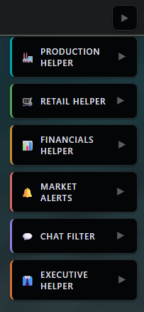

---

### 📈 Production Helper
Analyze production costs, profit margins, and break-even prices. Includes **building upgrade projections** so you can see how your next upgrade affects profitability.

- Cost per unit and total production cost breakdown
- Profit analysis for **Market Sell** and **Contract Sell** scenarios
- Transport fee calculations (full transport vs. 50% transport)
- Break-even price thresholds
- Building upgrade projection with production increase estimates

  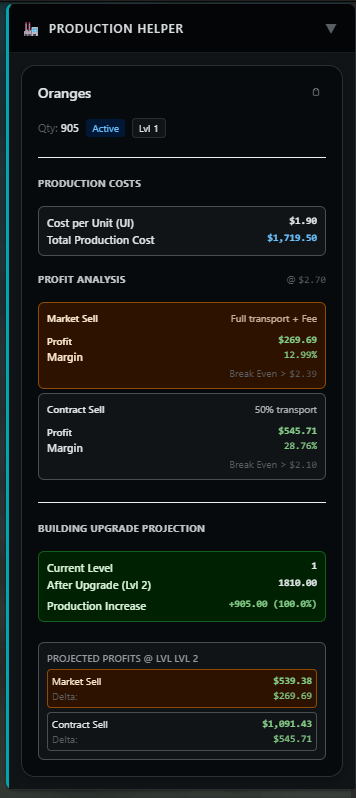
  &nbsp;&nbsp;
  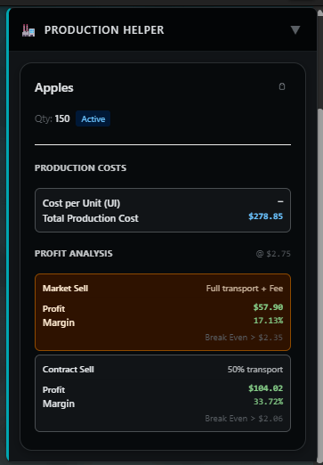

---

### 🛒 Retail Helper
Real-time retail profitability calculator. Shows **profit per minute**, hourly, and daily returns — plus live **Market Pulse** data with saturation and average retail price trends.

- Profit per minute / hour / day calculations
- Market Pulse indicator (Strong Buy, Buy, Stable, Sell, Strong Sell)
- Saturation percentage with trend direction
- Average retail price with change percentage

  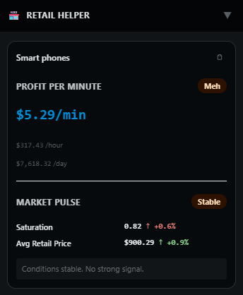

---

### 💰 Financials Helper
A complete **financial dashboard** with P&L statement, cash movement tracking, balance sheet data, and smart alerts. Supports multiple time periods (Today, Day, Week).

- Revenue, Gross Profit, Operating Profit, Net Profit KPIs
- Period-over-period comparison with delta and percentage change
- Cash Change & Cash Balance tracking
- Accounts Receivable estimates and Inventory valuation
- Intelligent alerts (cash drain warnings, liquidity alerts, operating profit alerts)
- Expandable view with full P&L waterfall, ratios, and transaction history

  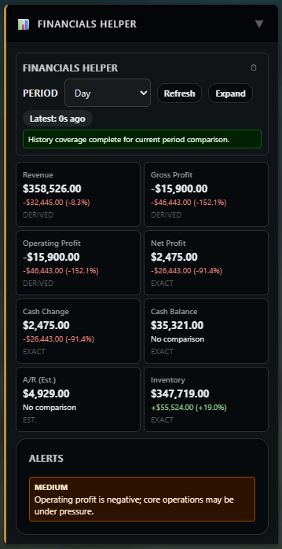

---

### 🔔 Market Alerts
Set price alerts for any product and quality level. The extension monitors market prices in the background and notifies you when prices drop below your target.

- Monitor up to 2 products simultaneously
- Select specific quality levels (Q0–Q5)
- Live current price tracking with last-checked timestamps
- Easy start/stop controls

  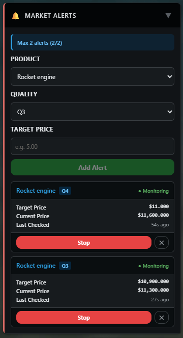

---

### 💬 Chat Filter — Search & Alerts

#### 🔍 Chat Search
Search the global chat rooms for **buying** or **selling** messages by product name and quality. Scans multiple pages of chat history to find the best deals.

  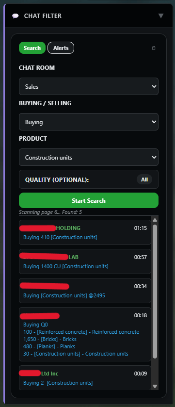
  &nbsp;&nbsp;
  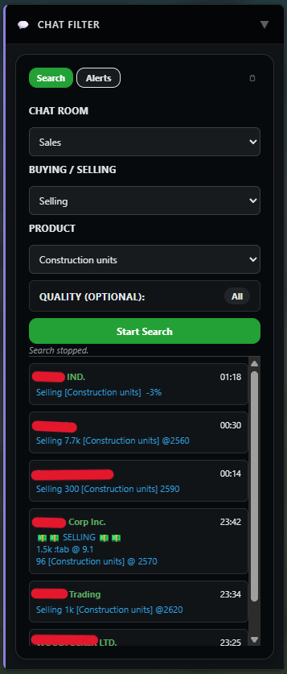

#### ⚡ Chat Alerts
Set keyword-based alerts on specific chat rooms. Get notified when someone posts a message matching your keywords — never miss a deal again.

  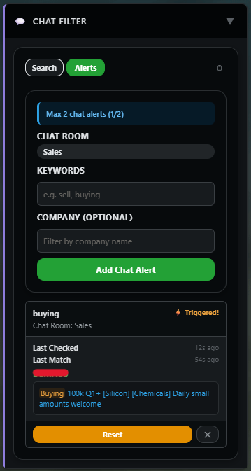

---

### 👔 Executive Helper
Track your **organic growth timer** and see which executives are eligible for the next roll — all without navigating away from your current page.

  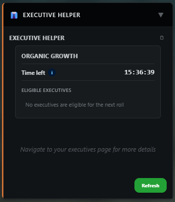

---

### 🤝 Smart Contract Management

#### Incoming Contracts — Intelligent Ranking
Incoming contracts are automatically ranked with **Gold ⭐, Silver, and Bronze** badges based on profitability. Each contract shows:
- Market price comparison (cheaper/same/more expensive)
- Retail Gross profit estimate (quality-adjusted)
- ROI percentage
- Recommendation badges (1st Rank = Accept Recommended)

  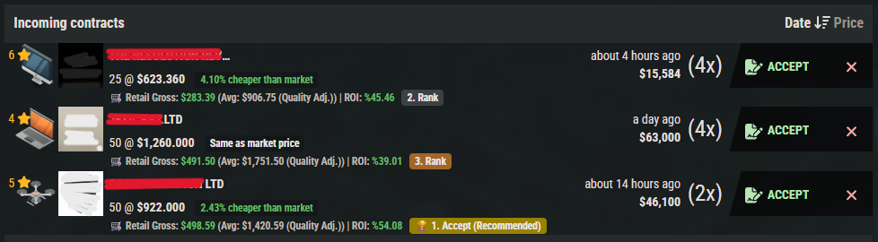

#### Outgoing Contracts — Profit Calculator
When sending contracts, the extension injects a **profit calculator** directly into the contract dialog. Set a market discount (e.g., -3%), auto-fill the price, and see Revenue, Sourcing, Transport, Profit, and Profit Margin instantly.

  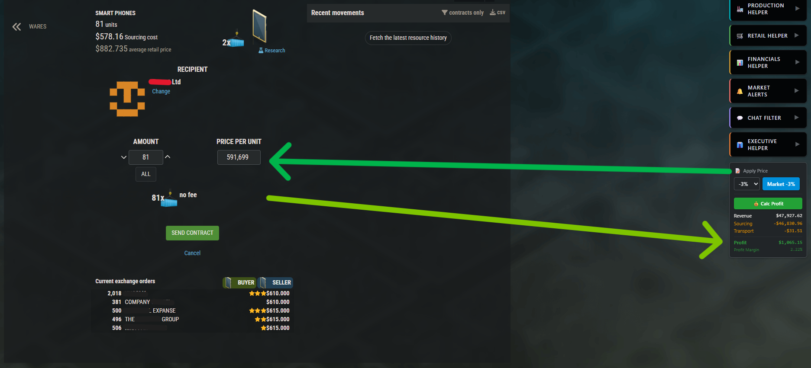

---

### 📦 Message Builders

#### Warehouse & Sales Message Builder
Select products from your warehouse, set a margin percentage, and generate a ready-to-paste sales message for the chat — with product emoji codes, quantities, quality, and prices.

  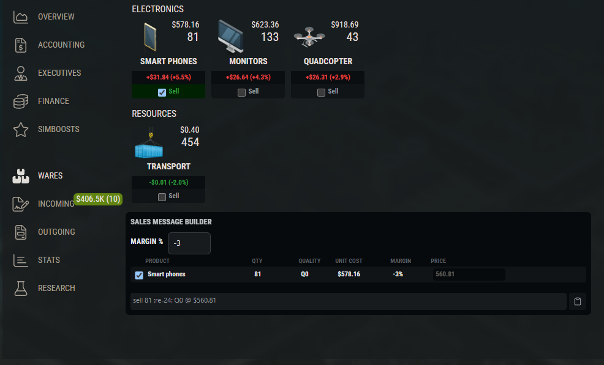

#### Purchase Builder
Select products you want to buy, set quantities and quality, and generate a formatted purchase message for the chat.

  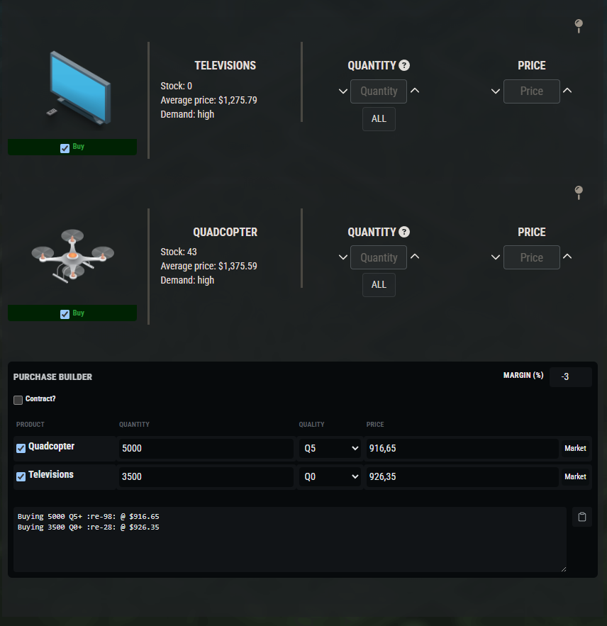

#### Building Upgrade Message Builder
When upgrading buildings, the extension shows the **exchange purchase cost**, warehouse resource usage, cost inflation savings, and generates a ready-to-paste buying message for all missing resources.

  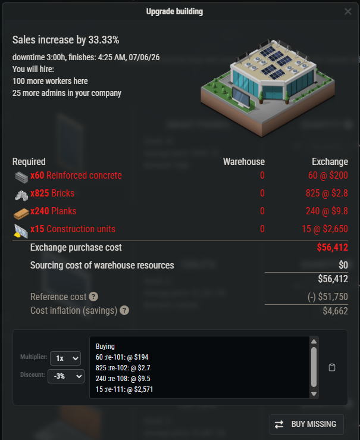

---

### ⏱️ Time-to-Level-Up Calculator
See your **XP/hour**, remaining XP, and estimated time to reach the next level — displayed directly in the game's top bar.

  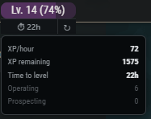

---

## 🌍 Supported Languages

SimCo Manager supports **12 languages** with full UI translation:

| Language | Code | Language | Code |
|----------|------|----------|------|
| 🇬🇧 English | `en` | 🇪🇸 Spanish | `es` |
| 🇹🇷 Turkish | `tr` | 🇵🇹 Portuguese | `pt` |
| 🇩🇪 German | `de` | 🇵🇱 Polish | `pl` |
| 🇫🇷 French | `fr` | 🇨🇿 Czech | `cs` |
| 🇮🇹 Italian | `it` | 🇯🇵 Japanese | `ja` |
| 🇨🇳 Chinese (Simplified) | `zh_CN` | 🇹🇼 Chinese (Traditional) | `zh_TW` |

The extension automatically detects your Sim Companies language setting.

---

## 📥 Installation

> 🛒 **Chrome Web Store** listing is coming soon! In the meantime, you can install it manually:

### Manual Installation (Chromium Browsers & Firefox)

Works with **Google Chrome**, **Microsoft Edge**, **Brave**, **Opera**, **Vivaldi**, **Mozilla Firefox**, and other modern browsers.

1. Go to the **[Releases](https://github.com/MuhammetFurkanYilmaz/simco-manager/releases)** page.
2. Download the appropriate `.zip` file for your browser (`simco-manager-chrome-v1.1.14.zip` or `simco-manager-firefox-v1.1.14.zip`).
3. **Extract** (unzip) the downloaded file to a folder on your computer.
4. **For Chrome/Edge/Brave/Vivaldi/Opera:**
   - Open your browser and navigate to `chrome://extensions/` (or `edge://extensions/` for Edge).
   - Enable **"Developer mode"** using the toggle in the top-right corner.
   - Click **"Load unpacked"** and select the folder you extracted.
5. **For Mozilla Firefox:**
   - Open your browser and navigate to `about:debugging#/runtime/this-firefox`.
   - Click **"Load Temporary Add-on..."** and select the `manifest.json` file inside the extracted folder.
6. Navigate to [simcompanies.com](https://www.simcompanies.com/) — you'll see the SimCo Manager sidebar on the right!

### Updating to a New Version

1. Download the new `.zip` from [Releases](https://github.com/MuhammetFurkanYilmaz/simco-manager/releases).
2. Extract it to the **same folder** (overwrite existing files).
3. **For Chrome/Edge/Brave/Opera:** Go to `chrome://extensions/` and click the **reload** (↻) button on SimCo Manager.
4. **For Firefox:** Go to `about:debugging#/runtime/this-firefox` and click **Reload** next to the extension.

---

## 🔒 Privacy & Permissions

SimCo Manager respects your privacy:

- **No data collection** — all data stays in your browser's local storage.
- **No external tracking** — no analytics, no telemetry.
- **Minimal permissions** — only `storage` (to save your settings) and GitHub API access (for update checks).
- **Works offline** — core features work without an internet connection once loaded.

---

## ❓ FAQ

<strong>Is SimCo Manager free?</strong>

 
Yes! SimCo Manager is completely free to use. It is a proprietary (closed-source) project, but there is no cost to download and use it.

<strong>Does it work on Firefox?</strong>

 
Yes! Firefox is officially supported. See the installation instructions above for how to load it as a temporary add-on.

<strong>Is it against Sim Companies rules?</strong>

 
SimCo Manager only reads publicly available data from the Sim Companies API and does not automate any gameplay actions. It is a passive analysis tool, similar to using a calculator or spreadsheet alongside the game.

<strong>How do I report a bug?</strong>

 
Please open an <a href="https://github.com/MuhammetFurkanYilmaz/simco-manager/issues">issue on GitHub</a> with a description of the problem and steps to reproduce it.

---

## © Copyright & License

This software is developed by **Furkan** and all rights are reserved. This is a **closed-source (proprietary)** project. Modifying, redistributing, or using it for commercial purposes is **strictly prohibited**. See the [LICENSE](LICENSE) file for full details.

---

---

# 🇹🇷 Türkçe

# SimCo Manager — Sim Companies İçin En Kapsamlı Tarayıcı Eklentisi

> **SimCo Manager**, popüler online iş simülasyonu oyunu [Sim Companies](https://www.simcompanies.com/) için geliştirilmiş, özelliklerle dolu bir yardımcı eklentidir. Kâr hesaplamalarını otomatikleştirin, finansal durumunuzu takip edin, sözleşmeleri yönetin, piyasa fiyatlarını izleyin ve çok daha fazlasını — tamamını oyun arayüzünden ayrılmadan yapın.

---

## ⚡ Neden SimCo Manager?

Sim Companies oyuncularının çoğu işlerini yönetmek için **hesap tabloları ve manuel hesaplamalar** kullanır. SimCo Manager bu ihtiyacı tamamen ortadan kaldırır — gerçek zamanlı analiz araçlarını doğrudan oyun arayüzüne yerleştirerek size rekabet avantajı sağlar:

- 📊 **Anlık finansal takip** — Gelir, Brüt Kâr, Faaliyet Kârı ve Net Kâr tek bakışta
- 🏷️ **Akıllı kontrat sıralama** — Gelen kontratlara Altın / Gümüş / Bronz rozetler
- 🔔 **Piyasa fiyat alarmları** — Hedef fiyata ulaşıldığında bildirim
- 🏭 **Üretim analizi** — Üretmeden önce kâr marjları ve başabaş fiyatları
- 💬 **Sohbet istihbaratı** — Global sohbeti alım/satım fırsatları için tarayın
- 🌍 **12 dil desteği** — Türkçe, İngilizce, Almanca, Fransızca, İspanyolca ve daha fazlası

---

## 🧩 Özellikler

### 📈 Üretim Yardımcısı (Production Helper)
Üretim maliyetlerini, kâr marjlarını ve başabaş fiyatlarını analiz edin. **Bina yükseltme projeksiyonları** ile bir sonraki yükseltmenin kârlılığınızı nasıl etkileyeceğini görün.

  
  &nbsp;&nbsp;
  

### 🛒 Perakende Yardımcısı (Retail Helper)
Gerçek zamanlı perakende kârlılık hesaplayıcısı. **Dakika/saat/gün başına kâr** ve canlı **Piyasa Nabzı** verileri.

  

### 💰 Finansal Yardımcı (Financials Helper)
Gelir tablosu, nakit akışı takibi, bilanço verileri ve akıllı uyarılar içeren tam bir **finansal kontrol paneli**.

  

### 🔔 Piyasa Alarmları (Market Alerts)
Herhangi bir ürün ve kalite seviyesi için fiyat alarmları kurun. Eklenti arka planda fiyatları izler ve hedef fiyatınızın altına düştüğünde sizi bilgilendirir.

  

### 💬 Sohbet Filtresi (Chat Filter)
Global sohbet odalarını **alım** veya **satım** mesajlarına göre arayın. Anahtar kelime alarmları kurun ve fırsatları kaçırmayın.

  
  &nbsp;&nbsp;
  

### 👔 Yönetici Yardımcısı (Executive Helper)
Organik büyüme zamanlayıcınızı ve müdür atama uygunluğunu takip edin.

  

### 🤝 Akıllı Kontrat Yönetimi
Gelen kontratlar otomatik olarak kârlılık bazında **Altın, Gümüş, Bronz** rozetleriyle sıralanır. Giden kontratlar için ise doğrudan sözleşme ekranına entegre kâr hesaplayıcı bulunur.

  

### 📦 Mesaj Oluşturucular
Depodan satış mesajı, alım mesajı ve bina yükseltme kaynak listesi oluşturun — tek tıkla sohbete yapıştırmaya hazır.

  

### ⏱️ Seviye Atlama Hesaplayıcısı
**XP/saat** hızınızı, kalan XP'nizi ve tahmini seviye atlama süresini oyunun üst çubuğunda görün.

  

---

## 📥 Kurulum

> 🛒 **Chrome Web Mağazası** listesi yakında yayınlanacak! Şimdilik manuel kurulum yapabilirsiniz:

### Manuel Kurulum (Chromium Tarayıcılar ve Firefox)

**Google Chrome**, **Microsoft Edge**, **Brave**, **Opera**, **Vivaldi**, **Mozilla Firefox** ve diğer modern tarayıcılarda çalışır.

1. **[Releases (Sürümler)](https://github.com/MuhammetFurkanYilmaz/simco-manager/releases)** sayfasına gidin.
2. Tarayıcınıza uygun en güncel `.zip` dosyasını indirin (`simco-manager-chrome-v1.1.14.zip` veya `simco-manager-firefox-v1.1.14.zip`).
3. İndirdiğiniz ZIP dosyasını bir klasöre **çıkartın** (ayıklayın).
4. **Chrome/Edge/Brave/Vivaldi/Opera için:**
   - Tarayıcınızda `chrome://extensions/` adresine gidin (Edge için `edge://extensions/`).
   - Sağ üst köşeden **"Geliştirici modu"**nu açın.
   - **"Paketlenmemiş öğe yükle"** butonuna tıklayıp çıkardığınız klasörü seçin.
5. **Mozilla Firefox için:**
   - Tarayıcınızda `about:debugging#/runtime/this-firefox` adresine gidin.
   - **"Geçici Eklenti Yükle..."** butonuna tıklayıp çıkardığınız klasörün içindeki `manifest.json` dosyasını seçin.
6. [simcompanies.com](https://www.simcompanies.com/) adresine gidin — sağ tarafta SimCo Manager menüsünü göreceksiniz!

### Güncelleme

1. [Releases](https://github.com/MuhammetFurkanYilmaz/simco-manager/releases) sayfasından yeni `.zip` dosyasını indirin.
2. **Aynı klasöre** çıkartın (mevcut dosyaların üzerine yazın).
3. **Chrome/Edge/Brave/Opera için:** `chrome://extensions/` sayfasında SimCo Manager'ın **yenile** (↻) butonuna tıklayın.
4. **Firefox için:** `about:debugging#/runtime/this-firefox` sayfasında eklentinin yanındaki **Yenile (Reload)** butonuna tıklayın.

---

## 🔒 Gizlilik ve İzinler

- **Veri toplama yok** — tüm veriler tarayıcınızın yerel deposunda kalır.
- **Harici izleme yok** — analitik veya telemetri gönderilmez.
- **Minimum izin** — yalnızca `storage` (ayarlarınızı kaydetmek için) ve GitHub API erişimi (güncelleme kontrolü için).

---

## © Telif Hakkı ve Lisans

Bu yazılım **Furkan** tarafından geliştirilmiştir ve tüm hakları saklıdır. Bu proje **kapalı kaynak (proprietary)** bir yazılımdır. Değiştirilmesi, yeniden dağıtılması ve ticari amaçlarla kullanılması **kesinlikle yasaktır**. Detaylar için [LICENSE](LICENSE) dosyasına bakın.
